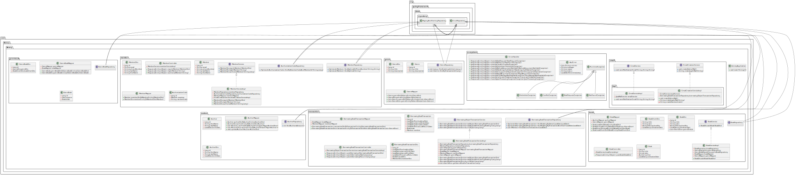

# :book: Library :book:
## Borrowing books service
_______

## <a id="up" />Navigation

### :bar_chart: [UML diagram](#diagram)
### :black_nib:[Description](#description)
### :triangular_ruler: [Technologies](#stack)  
### :book: [Library Service](#main-service)  
- [DB architecture](#architecture)
- [Endpoints](#endpoints)
### :snail: [Plans](#plans)

___
## :black_nib: <a id="diagram" />UML diagram

[Click here to open in browser](https://www.plantuml.com/plantuml/svg/pHhBKjmuy3vVuQCfm5z0KHa8sP22G0797hRse1aBeuqjUIKv2Pk5Rr_9RQjjF1g9XwlsmaZzQ4dTKZ_Ql5EQIDrKvM9T4gMIjQYoagqaaVVkjw1SqfKGtxBVxEZ8ZDvhaVnQx2TdWXS9oyseHLbmqGqCp59UtmcfBNmrc2mU5blMgsYreZ8xRt-cArrhoSoOLeILEAtl1AUV6yk2GBE4_amgYf1R9W5ajy2uflAMhAd_s73aAreBnRIGzsOlZyaPK_h0RkZGoEFvoKypDy9FSvKYQgSdR2K0vT7zZIHSaRLcWf_cgINSsQuCqcYZj6pP_emrCJtJzE2MV4tAzqJJPCMalhEZPwZ_M70jHLbIM1k0rrH-PqPhrN1sMjNbOZUvegeMND4Jhfc-FxXO_KNN-Z1HhE2d7DXJPzaTFqCf2aSFXzf234fY_z0X0sWMZHmwB9xBsjZjqRlr8SrqjoEyPuDx4VRNU66o8o6b-64OxSCQtAHpKjUTWIoccwxSq1ckmrI3YL6gJsmoMDiSuaOCS620rCVQsNOBsWbtma0-KdY5x-6pCcI7OERNQN3yiF3DtB2AjeeqB6O-VazrIJYd-RNre3xa2Sy7A9Hfbcr8UKLr8paGjAPhrtBcwWpr-WioUABjINrq0p-t2fAuRIAes_28vga3BSRpBRjnztWR-aLtljjLXofm7BYpi1NmEj5tFo3dTwRl8880gVcnSG6SGqYGR2yG21foxIVZDsBEgFk9-Y3aG4pB5df3zEUQrfPQPKSalw9_DrJf4m2sh-S1c4E1r1lDDTCbnMbErLgoLlZsszzc0Hap5pixiSEdD_qJ-KxEMpZFZQbfvSP6izy5onDbPf-5PhTiJUnwhPZUGUDFP3nfqoHhg64iwJCcakTsc7Pp8oyoF2sxyD5ky5ZaJnEIYrPJf3oO4FPvnnNXkQWiPCbpU1YdUJWCUVLyB2dPv5c6HaZeOF9ChmDNUYDHRxYrtG9zJrS6Q4sSsiS29-fmPsrKHdEQTp4cGAsaODp8h6XqwaW_kCs6n8yB-B5DnaZe1EZIis1QCwJn967nQGtUxjZ20WyUS2hkeM7oqwaO0B2t28UFSRVDSUmCyX5yfa3J5p5zjjB1Mh99IhABnS-43n70t5DZYJJT2I90iM75uEA_l6wMgHLtUaE3cj4ubsbMPUSTxJpiji1RW2z0F_W2Vnlz8cUf4L-VU3qfduwyxgrJapVPYIgoQg6qMoAKd_Xa4Bs-Swmtv1l5l2AQ3VBQ0MDyUc6knWVHy7oKNCHVD_HwUEryqU8n52tY2tFdX7OJ0E1BkX40wPuoJC06auVNkmW7xyWDBIHqC3tqIRSqwIKfw86JSEXu4UHRxIcxvGNjDNLED0LejwSznuQAYlNoJbq-l-nFwtSJ9mNeZthF3N1qcZ177pwS8sklX24MMQETxQJ26iSoI_VCgcXJI2ociAcYmY7Fbv26Jdi6lykwxiD1U-D_AMqcwmUuAXLXl7j1V_pv1iqDiw__HtME6G34Hqo3gdwqU8Yh3_o9Ji3Fc3LcxW5E7FA9b49-93o78EQD07Sj2LQ7wOP2SIV4tdl_j1_4ivfGUskkfKxxGJohAOXNBCyfJzqedlcS6iFaIraq5UNQxFihALcURWR7YpKs8gTSqq8Qt5ScolQzfPl1yMA_SDNKjP2QvXSrbMFkr8EDb7rQbhGWPNzc5Ej312L-rBe-fqgHmjwCAqfoiYef2lRYu--Cqf8mhgUgJ3t8ECcVbE2NKgpDvXWl71zAzn1uUm8UX_2a4M0usu8Va6fPYORhr2Squ8dzMQfPwetwP8zlrITxV56Vx24gk4-yxjkMKu_JPXsCB3XWkiWWwkiN-UYXRTIf-UZURbEbxWHxRhJp0c43p9BdNnIL7icW5WYp80FITpMGCDZLSyf5pDT7hNR8g042pzhJ6G5obq4xU4U-4nrTbpLh0on-LuIxT9XG2rPOf5JWvn0WAL62uzncOOrb6ESoslmngAgEtjCq2CRsOYRbBlP1BKry4HkVb0wxos_SMaQDJ5AA-8xtuAR17biS5Yp3OcLOgBWYPLIWkEB4q0s_Ba-aOZauxKoD8PjNUS9w67fSdZxrs2BZjuOcaQuD6zqH1qa-jmROllVTDWOkv2LsVz9ndod02jJHqUBveQAB4w6UMto9FTq5thtnfqRxjXP25fcgxRvk9Qde3o6_PJdH99DElzabAGpUEEnh8RKP3LH_yE_-Vln_K4IjTYoR_EKhl3h1CGjcsLjyRLq47CjLmpMhC6FrdZJm1MuHsON5SyL_HvljUdYSnWnt9NQv-EPYl3PztsA2pispYeTwReDvtCmCjWgkDCkZcZGS5bkTVD0uI3c_OM2nESpXbp_7MQRbxGpdcQmnwvdYeyOCHurTUkQdDQqdvbXccgJF7RZ0ySvYD_yQxoZFcwhy3m00)

___
## :black_nib: <a id="description" />Description

Mini-application allows library members to borrow books (and other different items in the near future) and owners to control 
particular rental period.

Service provides opportunities:
- to log in, sign in and authorize a member;
- to add a new book;
- to book particular item, borrow it and return back;
- to send scheduled email notifications for members who forgot to bring an item back in time;

An application consists of 4 layers (layer architecture):
- model layer, where we can see only entities which can communicate only between each other using composition.
- repository layer, where data management's realized. Also we can notice a separation between test(H2) and 
prod(Postgres) DB in application.properties file. Current layer can communicate only with the model layer.
- service layer, where all the business logic elements are focused. The layer can communicate with model and
repository layers. Also here we can utilise DTO and mappers which help us to make manipulations with objects safer
and concentrate our attention on data domain.
- controller layer, which connects and separates other services and users from business logic elements on the 
service layer at the same time. So, here we can see only service layer.

Application software design follows SOLID principles:
- _Single responsibility_ - all the classes have particular single functionality. For example, DTOs are responsible only
for transferring encapsulated information inside and out of the application and through the business logic. 
Service classes have to deal with a business logic. Mappers are made to move data from entity to DTO and vice versa.

- _Open-closed_ - classes are opened for extensions and closed for changes inside. Of course, in current state we can't
see it clearly, but if we didn't have an access to the source code, we could only use a public API... All the classes 
here can be expanded using inheritance or different patterns such as strategy, decorator, etc.. At the same time, if we will 
try, for example, to interact with classes from different module, we can only use its API, but can't change anything inside
obviously.

- _Liskov substitution_ - For example, now we have service interface BookService and a class BookServiceImpl 
implementing such interface. Current interface are used in corresponding controller. If we expanded BookServiceImpl
with ExtraBookServiceImpl and didn't change method signatures(to be honest, we just couldn't change it because 
of the contract restrictions), BookServiceImpl and ExtraBookServiceImpl could be easily substituted.

- _interface segregation_ - here in the app we don't have any classes which implement interfaces or extend classes
which are not bounded with its one single main destiny. For example, it would be strange, if BorrowingBookTransactionService 
class implemented EmailService interface to send emails for library members. We should have a separate service for such aims.

- _dependency inversion_ - Spring Framework was used as a framework here in the application. It is based on inversion of
control(IoC) principle, which means than we have to depend on abstractions, but not realization. For example, in each controller
class we can see service interface variables. Concrete realizations appear during context initialization dynamically. We
don't need to be bounded to concrete realization in the source code, which makes it easier to understand, maintain and debug
our classes.

[Navigation](#up)
___
## :triangular_ruler: <a id="stack" />Technologies
- Java 21  
- Spring Boot 3  
- Lombok  
- Slf4j  
- PostgreSQL, H2   
- Jakarta validation  
- Maven  
- Hibernate ORM

[Navigation](#up)
___

## :book: <a id="main-service" />Library Service
___
### <a id="endpoints" />ENDPOINTS

#### _Books_
`POST   /books` - adding new book.  

#### _Members_
`POST   /members` - sign in a new member.  
`GET    /members/{email}` - log in.
`GET    /members/{memberId}/{code}` - authorize a member.

#### _Borrowing book transaction_
`POST   /borrowings` - adding new booking for particular item.  
`PATCH  /borrowings/{transId}/take/{userId}` - taking an item using existing booking.
`PATCH  /borrowings/{transId}/return/{userId}` - returning an item.

[Navigation](#up)
___
### <a id="architecture" />DB architecture

Relational database table structure

### Table description:
  
***genres***

Contains information about particular book genres. Data is converted into entities with type Genre.
Table includes fields:

| name          | field type    | description                 | constraint            |
|---------------|---------------|-----------------------------|-----------------------|
| `genre_id`    | BIGINT        | genre individual identifier | PRIMARY KEY, NOT NULL |
| `title`       | VARCHAR(150)  | genre title                 | NOT NULL              |
| `description` | VARCHAR(1000) | genre description           | -                     |

***authors***

Contains information about particular book authors.
Table includes fields:

| name         | field type   | description                  | constraint            |
|--------------|--------------|------------------------------|-----------------------|
| `author_id`  | BIGINT       | author individual identifier | PRIMARY KEY, NOT NULL |
| `first_name` | VARCHAR(150) | author first name            | NOT NULL              |
| `last_name`  | VARCHAR(150) | author last name             | NOT NULL              |
| `birth_date` | DATE         | author birthdate             | -                     |

***books***

Contains information about particular books.
Table includes fields:

| name               | field type     | description                 | constraint                                                  |
|--------------------|--------------|-----------------------------|--------------------------------------------------------------|
| `book_id`          | BIGINT       | book individual identifier  | PRIMARY KEY, NOT NULL                                        |
| `title`            | VARCHAR(150) | book title                  | NOT NULL                                                     |
| `isbn`             | VARCHAR(10)  | individual publisher's code | NOT NULL                                                     |
| `author_id`        | BIGINT       | author identifier           | FOREIGN KEY (author_id) REFERENCES authors ON DELETE CASCADE |
| `publication_date` | DATE         | publication date            | -                                                            |

***genres_books***

Table realizes many-to-many link type for tables "genres" and "books".
Table includes fields:

| name            | field type | description         | constraint                                                 |
|-----------------|------------|---------------------|------------------------------------------------------------|
| `genre_book_id` | BIGINT     | link identifier     | PRIMARY KEY, NOT NULL                                      |
| `genre_id`      | BIGINT     | genre identifier    | FOREIGN KEY (genre_id) REFERENCES genres ON DELETE CASCADE |
| `book_id`       | BIGINT     | book identifier     | FOREIGN KEY (book_id) REFERENCES books ON DELETE CASCADE   |

***members***

Contains information about library members.
Table includes fields:

| name           | field type    | description           | constraint            |
|----------------|---------------|-----------------------|-----------------------|
| `member_id`    | BIGINT        | member identifier     | PRIMARY KEY, NOT NULL |
| `first_name`   | VARCHAR(256)  | member's first name   | NOT NULL              |
| `last_name`    | VARCHAR(256)  | member's last name    | NOT NULL              |
| `email`        | VARCHAR(256)  | member's email        | NOT NULL, UNIQUE      |
| `phone_number` | VARCHAR(13)   | member's phone number | UNIQUE                |

***borrowing_book_transactions***

Contains information about bookings and item borrowings for each member with start and end dates.
Table includes fields:

| name                             | field type  | description                               | constraint                                                             |
|----------------------------------|-------------|-------------------------------------------|------------------------------------------------------------------------|
| `borrowing_book_transaction_id`  | BIGINT      | borrowing transaction identifier          | PRIMARY KEY, NOT NULL                                                  |
| `booking_date`                   | TIMESTAMP   | moment when member's booking was received | NOT NULL                                                               |
| `planned_start_date`             | DATE        | planned borrowing beginning               | NOT NULL                                                               |
| `planned_end_date`               | DATE        | planned borrowing ending                  | NOT NULL                                                               |
| `actual_return_date`             | TIMESTAMP   | moment when member returned a book        | -                                                                      |
| `book_id`                        | BIGINT      | borrowed book identifier                  | FOREIGN KEY (book_id) REFERENCES books ON DELETE CASCADE               |
| `member_id`                      | BIGINT      | library member identifier                 | FOREIGN KEY (member_id) REFERENCES members ON DELETE CASCADE, NOT NULL |

***authorization_codes***

Contains information about sign in, log in, authorization process of members.
Table includes fields:

| name                    | field type | description                                             | constraint                                                             |
|-------------------------|------------|---------------------------------------------------------|------------------------------------------------------------------------|
| `authorization_code_id` | BIGINT     | borrowing transaction identifier                        | PRIMARY KEY, NOT NULL                                                  |
| `random_code`           | VARCHAR(7) | Random code generated every time member wants to log in | NOT NULL                                                               |
| `member_id`             | BIGINT     | library member identifier                               | FOREIGN KEY (member_id) REFERENCES members ON DELETE CASCADE, NOT NULL |

[Navigation](#up)

___
## :snail: <a id="plans" />Plans
- new item types (DVDs, magazines, etc.);
- cookies;
- generating individual tokens;
- opportunity to work with authors and genres;
- comments and ratings;
- borrowing history for each book;
- etc.

[Navigation](#up)